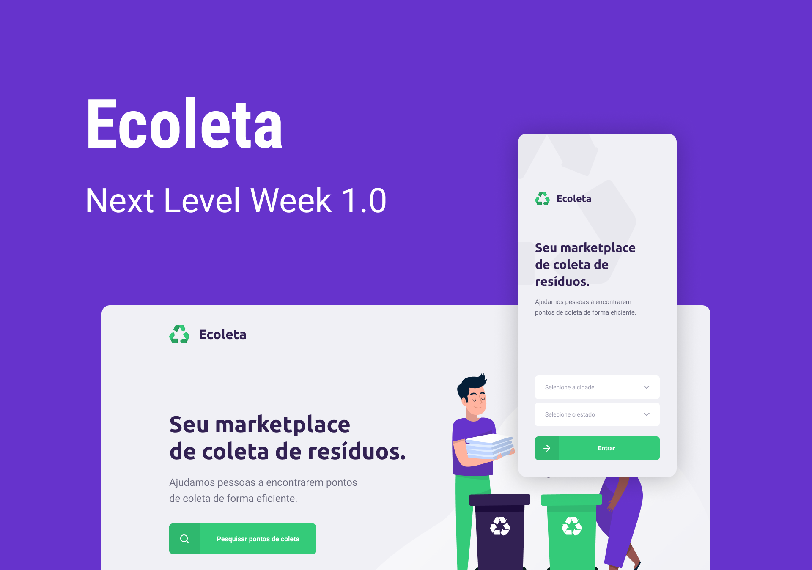

# Ecoleta     



O Ecoleta é aplicativo que reúne pontos de coleta de resíduos recicláveis, facilitando a comunicação entre os pontos de coleta e as pessoas que querem descartar seus resíduos recicláveis corretamente e foi desenvolvido durante a Next Level Week #01 da Rocketseat.

## Como instalar
Para instalar o projeto, você irá precisar ter o Node e o NPM ou Yarn instalados para baixar as dependências.


### Instalação - Back-end(Server e API)

```bash
cd server
npm install
npm run dev 
```

Se estiver usando Yarn, utilize
```bash
cd server
yarn install
yarn dev
```

### Instalação - Front-end(Web)

```bash
cd web
npm install
npm start
```

Se estiver usando Yarn, utilize
```bash
cd web
yarn install
yarn start
```

Quando terminar, a página da aplicação web será aberta no navegador.

### Instalação - Mobile(Aplicativo)

Vá no arquivo `api.ts` dentro de `mobile/src/services` e coloque o ip da máquina que está executando o seu servidor.
Em seguida, execute o projeto

```bash
cd mobile
npm install
npm start
```

Se estiver usando Yarn, utilize
```bash
cd mobile
yarn install
yarn start
```

Ao executar o projeto, uma página de debug será aberta no seu navegador. 

Para executar o aplicativo no seu dispositivo, baixe o aplicativo *Expo* na Play Store ou App Store e faça o scan do código QR que será disponibilizado na página de debug, e aguarde a instalação.

---
###### Developed on Next Level Week from [RocketSeat](https://rocketseat.com.br) :rocket:.